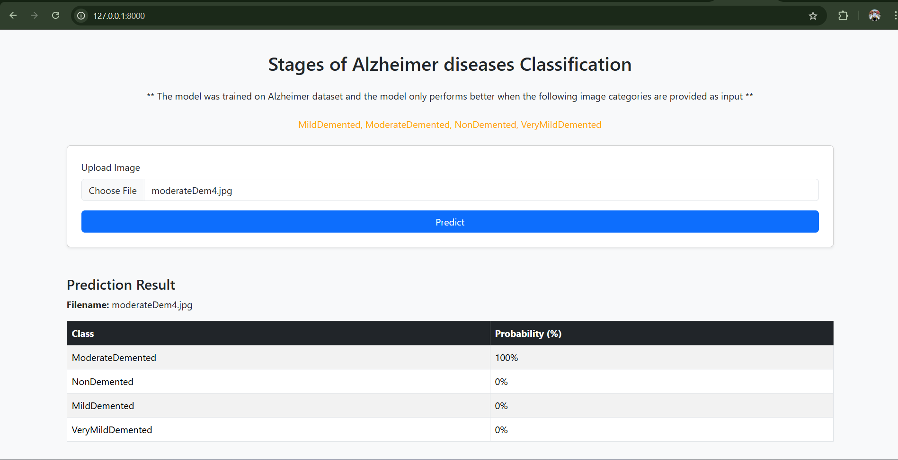

# FastAPI_Alzheimer_classification
This is end-to-end deep learning ptoject to classify stages of Alzheimer disease. 

## ptoject worflow and description

- collected dataset from [kaggle](https://www.kaggle.com/datasets/uraninjo/augmented-alzheimer-mri-dataset-v2)
- preprocessed and clean data
- Augmented the train and validation data
- Train on different CNN architecture picked the best model with 98% accuracy
- Created a api to interact with model

## setup instruction

### 1. Clone the Repository

```bash
git clone https://github.com/mdparvex/FastAPI_Alzheimer_classification.git
cd countries_api
```

## Setup locally
Create a virtual environment
```bash
python -m virtualenv <environment_name>
```
Activate the virtual environment
```bash
cd <environment_name>\Scripts
activate
```
install requirements.txt
```bash
pip install -r requirements.txt
```

## How to Run the Server
Go to the project root directory and run
```bash
uvicorn app.main:app
```
## Go to the url
Access it at: http://127.0.0.1:8000/

### Run with Docker
build the docker image
```bash
docker build -t alzapp:latest
```
run the docker image
```bash
docker run -d -p 8000:8000 alzapp:latest
```

Access it at: http://127.0.0.1:8000/

# Play with the portal
choode image from the test images folder

